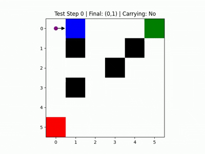

# Warehouse Q-Learning Robot

This project implements a Q-learning-based robot simulation for navigating a warehouse grid. The robot learns to pick up items from a designated location and drop them off at another location while avoiding obstacles.

## Project Structure
```
warehouse-q-learning/
├── q_table.npy              # Trained Q-table saved as a NumPy array
├── train_robot.ipynb        # Jupyter notebook to train the robot using Q-learning
├── test_robot.ipynb         # Jupyter notebook to test the robot's performance after training
├── training_video.gif       # gif showing the training process in action
├── training_video.mp4       # Video showing the training process in action
├── testing_video.gif        # gif showing the robot's behavior during testing
├── testing_video.mp4        # Video showing the robot's behavior during testing
├── training_frames/         #  Folder containing individual frames from the training session
├── testing_frames/          # Folder containing individual frames from the testing session
└── .ipynb_checkpoints/      # Auto-generated Jupyter notebook checkpoints (can be ignored)
```


## Features

- **Training**: The robot learns using Q-learning to navigate the grid, pick up items, and drop them off.
- **Testing**: The trained Q-table is used to test the robot's performance in the same environment.
- **Visualization**: The robot's movements are visualized as images and compiled into videos for both training and testing.

## How to Use

### 1. Train the Robot
Run the `train_robot.ipynb` notebook to train the robot. The training process:
- Initializes a 6x6 grid with obstacles, a pickup point, and a drop-off point.
- Uses Q-learning to update the Q-table over multiple episodes.
- Saves the Q-table as `q_table.npy`.
- Generates frames of the robot's movements and compiles them into `training_video.avi`.

### 2. Test the Robot
Run the `test_robot.ipynb` notebook to test the robot. The testing process:
- Loads the saved Q-table (`q_table.npy`).
- Simulates the robot's movements in the grid using the learned policy.
- Generates frames of the robot's movements and compiles them into `testing_video.avi`.

## Requirements

- Python 3.7+
- Required libraries:
  - `numpy`
  - `matplotlib`
  - `opencv-python`
  - `joblib`

Install the dependencies using pip:

```bash
pip install numpy matplotlib opencv-python joblib
```

## Grid Details
- Grid Dimensions: 6x6
- Cell Types:
  - EMPTY: Free space
  - OBSTACLE: Blocks the robot's path
  - PICKUP: Location to pick up items
  - DROPOFF: Location to drop off items
  - ROBOT: Robot's current position
- Actions: up, down, left, right

  
## Q-Learning Parameters
- Learning Rate (α): 0.1
- Discount Factor (γ): 0.9
- Exploration Rate (ε): 0.1
- Episodes: 500


## Outputs
- Training:
  - q_table.npy: Saved Q-table after training.
  - training_frames/: Frames of the robot's movements during training.
  - training_video.avi: Video compiled from training frames.
- Testing:
  - testing_frames/: Frames of the robot's movements during testing.
  - testing_video.avi: Video compiled from testing frames.


## Example Visualization
Training


Testing




## License
This project is licensed under the MIT License. See the LICENSE file for details.

